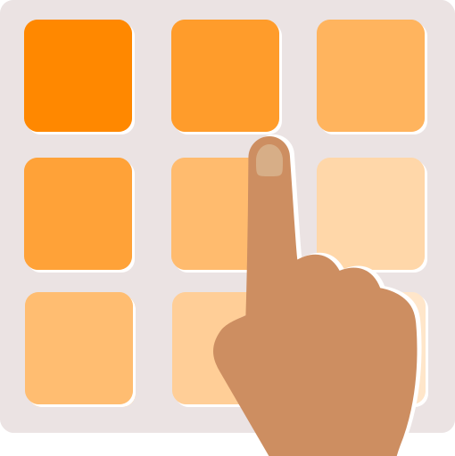

<div align="center">
  
  
</div>

# Touch-Screen

A modular capacitive touch interface built with an ESP32, aluminum plates, and LEDs. It detects finger movements (Up, Down, Left, Right) using a scalable matrix of touch sensors.

---

## Overview

This project demonstrates how to build a low-cost touch screen prototype using conductive materials and the ESP32’s built-in capacitive touch pins. It serves as a flexible foundation for gesture interfaces, interactive systems, or experimental hardware UI.

---

## Materials

* **ESP32** – Main microcontroller responsible for signal processing and movement detection.
* **Aluminum Sheet or Foil** – Used as touch plates for capacitance sensing.
* **LEDs** – Provide visual feedback for touch or movement events.
* **Thin Wooden Board** – Serves as a mounting surface and insulator for the aluminum plates.

---

## Algorithm Overview

The touch system uses at least six capacitive sensors, arranged in a 2x3 matrix. This layout can be expanded modularly depending on the number of additional plates.

### Vertical Detection (Up/Down)

* The total number of vertical plates must be even.
* This configuration enables detection of movement between upper and lower rows.
* The ESP32 has eight available touch pins, so the algorithm is optimized to use them efficiently.

### Horizontal Detection (Left/Right)

* Each group of three plates acts as an analysis region to predict horizontal movement.
* Movements can start from any position—no fixed origin required.
* The system supports both even and odd numbers of horizontal modules.

### Base Configuration

```
1 | 2 | 3
4 | 5 | 6
```

### Expanded Modular Pattern

```
1 | 2 | 3 | 4 | 5 | 6
4 | 5 | 6 | 4 | 5 | 6
1 | 2 | 3 | 4 | 5 | 6
4 | 5 | 6 | 4 | 5 | 6
```

Repeated numbers represent interconnected plates between modules, allowing scalability while keeping the detection algorithm consistent.

---

## Future Improvements

* Implement gesture recognition (diagonal or circular motion).
* Add an OLED display or web interface for visualization.
* Improve signal filtering and stability.
* Develop a reusable library for dynamic matrix configuration.

---